Uncertainty in Inflation Forecasting Using Bayesian Methods
================
Samuel Louissaint

-   [Introduction](#introduction)
    -   [Prior Predictive Check - Visualize
        Priors](#prior-predictive-check---visualize-priors)
-   [Modeling with Real Data](#modeling-with-real-data)
    -   [Fit Model](#fit-model)
-   [Model Diagnostics](#model-diagnostics)
-   [Posterior Sampling and Updated
    Priors](#posterior-sampling-and-updated-priors)
-   [Stratification and Model
    Comparison](#stratification-and-model-comparison)

# Introduction

The project will be using some macroeconomic knowledge, specifically the
Monetarist understanding of economic activity. It’s defined by a
deceivingly simply formula:
  
According to this definition, M is the money supply, V is the money
velocity, P is the price of goods and services, and Q is the quantity of
goods and services. Meaning the price of goods can be demonstrated as
such:
  
In terms of economic indicators measured by the Federal Reserve Bank,
this formula is best represented by:  
**P - Consumer Price Index for All Urban Consumers: All Items in U.S.
City Average (though for this investigation we’ll be using the
percentage change from previous year figures to represent inflationary
movements)**  
**M - Real M2 Money Stock**  
**V - Velocity of M2 Money Stock**  
**Q - Real Gross Domestic Product**  
Luckily, the Fed saved me the trouble of adjusting these figures for CPI
myself, and for that I thank them deeply. In terms of a scientific
model, there isn’t an independent variable we can manipulate freely like
in a controlled experiment. However, there is a tool regularly used by
the Fed to temper inflation and unemployment, the interest rate.
According to macroeconomic theory, increasing interest rates decreases
lending/borrowing and thus consumer spending, decreasing inflation at
the cost of economic growth. Because it is the only indicator that is so
closely related to inflation ***and*** can be directly manipulated —
though often as a response to other economic activity or fiscal policy
changes — it serves as the exposure variable in the following directed
acyclic graph (DAG).

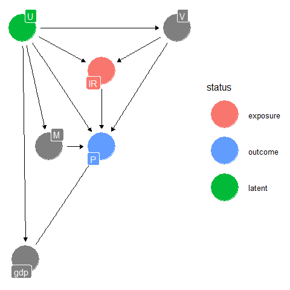<!-- -->

It is crucial to remember that this model, like all models, is a
simplified portrayal of the interactions it is meant to describe. Due to
the compounding impacts of exogenous shocks and indicators outside the
scope of the model, we cannot model the direct effect of the interest
rate on inflation. However, we are able to model the total effect of the
interest rate on inflation if we control for money velocity.

The next step will be to create our priors and build a generative model.
The loop I crafted to do so has its limitations, though I wasn’t able to
find any functions or loops to use as reference. The goal is to create
time series that behaves similarly to the indicators they’re meant to
mimic. \# Generative Model \## Forming data from priors

``` r
par(mfrow=c(2,2))
set.seed(9)
N <- 600 # Number of observations
time <- seq(1, N, 1) # Time vector
P <- c(4.5) # "true" mu
for(i in seq(599)){
  p <- rnorm(1, mean = P[i], rnorm(1, 0.3,0.1)) # Makes sure next point stems from previous
  P <- c(P, p)}
P <- P/100
plot(time, P, 'l')

set.seed(18)
IR <- c(1)
for(i in seq(599)){
  ir <- round(rnorm(1, mean = IR[i], 0.04),1)
  IR <- c(IR, ir)}
IR <- IR / 100
plot(time, IR, 'l')

set.seed(4)
V <- c(2)
for(i in seq(599)){
  v <- round(rnorm(1, mean = V[i], 0.04), 2)
  V <- c(V, v)}
plot(time, V, 'l')
```

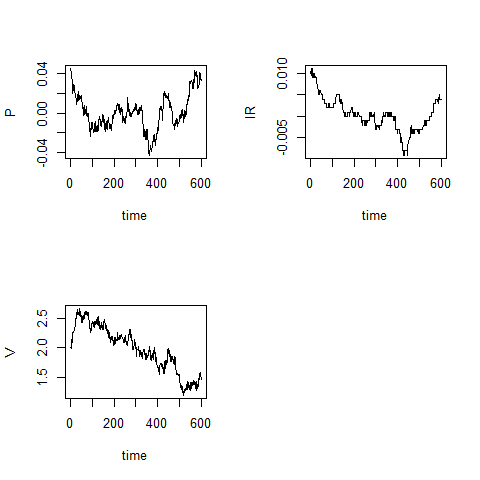<!-- -->

Here we have simulated data for the indicators going into the model. We
use those to model the relationship using the priors we set as well as
priors included in the Bayesian structure time series (bsts) package.

## Prior Predictive Check - Visualize Priors

``` r
gm <- cbind.data.frame(time, P, IR, V)
gm_test <- gm[501:600,]
gm <- gm[1:500,]
gmod_components <- list()
gmod_components <- AddStudentLocalLinearTrend(gmod_components, y = gm$P)
gmod_components <- AddSeasonal(gmod_components, y = gm$P, nseasons = 50, season.duration = 4)
gmod <- bsts(P~IR+V, gmod_components, niter = 5000, data = gm)
```

``` r
gpred <- predict(gmod, horizon = 10, gm_test)
plot(gpred, ylim= c(-0.1, 0.1))
```

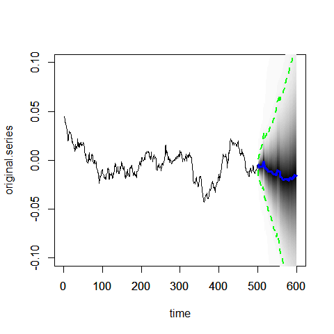<!-- -->

``` r
forecast_time = 100
fits = gm %>%
  add_draws(colSums(aperm(gmod$state.contributions, c(2, 1, 3))))

predictions = data.frame(time = max(gm$time) + 1:forecast_time) %>%
  add_draws(predict(gmod, newdata = gm_test, horizon = forecast_time)$distribution, value = ".prediction")

predictions_with_last_obs = gm %>% 
  slice(n()) %>% 
  mutate(.draw = list(1:max(predictions$.draw))) %>% 
  unnest(cols = c(.draw)) %>% 
  mutate(.prediction = P) %>% 
  bind_rows(predictions)
gm %>%
  ggplot(aes(x = time, y = P)) +
  geom_line(aes(y = .value, group = .draw), alpha = 1/20, data = fits %>% sample_draws(100)) +
  geom_line(aes(y = .prediction, group = .draw), alpha = 1/20, data = predictions %>% sample_draws(100)) +
  geom_point() +
  ylim(c(-0.06,0.06))
```

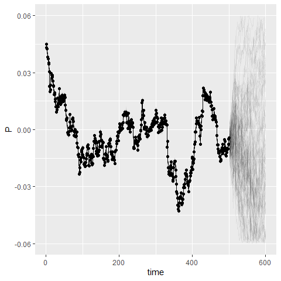<!-- -->

We see from the prior predictives that the model and priors are behaving
in a way we’d expect. The values themselves aren’t what you’d expect
from inflation though this a result of struggling to find rnorm values
that looked like the inflation curve. We may attribute the fuzziness in
predictions through even the observed time values to the fact that the
generated priors aren’t actually related. Additionally, seeing such a
wide range of prior predicted values is expected and satisfactory for
something as unpredictable as the economy.

With a working set of priors, we can now move onto modeling real data…or
that is what I’d like to say. However, the real economic indicators that
the priors represent do not exactly in the way described. Specifically,
in terms of timing. The interest rate is a reactive indicator, meaning
it moves *because* inflation moved. Thus there was the need to create
the DAG below, which introduces the concept of time to the model.

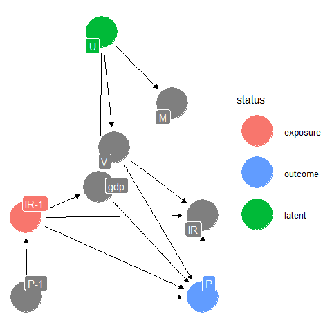<!-- -->

# Modeling with Real Data

``` r
# Load data
gdp_file = "https://github.com/SamL153/bayesian_stats_project/raw/master/gdp.csv"
inflation_file = "https://github.com/SamL153/bayesian_stats_project/raw/master/inflation_rate.csv"
interest_file = "https://github.com/SamL153/bayesian_stats_project/raw/master/interest_rate.csv"
msupply_file = "https://github.com/SamL153/bayesian_stats_project/raw/master/money_supply.csv"
mvelocity_file = "https://github.com/SamL153/bayesian_stats_project/raw/master/money_velocity.csv"
Q = read_csv(gdp_file, show_col_types = F) %>%
  filter(DATE >= as.POSIXlt('1980-01-01'))
P = read_csv(inflation_file, show_col_types = F) %>%
  filter(DATE >= as.POSIXlt('1980-01-01')) %>%
  mutate(CPIAUCSL_PC1 = as.double(CPIAUCSL_PC1)/100)
I = read_csv(interest_file, show_col_types = F) %>%
  filter(DATE >= as.POSIXlt('1980-01-01'), !is.na(DFF)) %>%
  mutate(DFF = as.double(DFF)/100)
M = read_csv(msupply_file, show_col_types = F) %>%
  filter(DATE >= as.POSIXlt('1980-01-01'))
V = read_csv(mvelocity_file, show_col_types = F) %>%
  filter(DATE >= as.POSIXlt('1980-01-01'))
monthly_train <- P %>% inner_join(I, by = 'DATE') %>% inner_join(M, by = 'DATE') %>% left_join(Q, by = 'DATE') %>% left_join(V, by = 'DATE') %>%
  rename(P = CPIAUCSL_PC1, I = DFF, M = M2REAL, Q = GDPC1, V = M2V) %>%
  filter(DATE < as.POSIXlt('2021-07-01')) %>%
  mutate(m = month(DATE),
         V = na.spline(V),
         Q = na.spline(Q))
monthly_test <- P %>% inner_join(I, by = 'DATE') %>% inner_join(M, by = 'DATE') %>% left_join(Q, by = 'DATE') %>% left_join(V, by = 'DATE') %>%
  rename(P = CPIAUCSL_PC1, I = DFF, M = M2REAL, Q = GDPC1, V = M2V) %>%
  filter(DATE >= as.POSIXlt('2021-07-01')) %>%
  mutate(m = month(DATE),
         V = na.spline(V),
         Q = na.spline(Q))
I_m1_train <- rbind(I[1,], I) %>%
  filter(DATE < as.POSIXlt('2021-06-01')) %>%
  rename(I_m1 = DFF)
I_m1_test <- I %>%
  filter(DATE >= as.POSIXlt('2021-06-01'), DATE < as.POSIXlt('2022-03-01')) %>%
  rename(I_m1 = DFF)
P_m1_train <- read_csv(inflation_file, show_col_types = F) %>%
  filter(DATE >= as.POSIXlt('1979-12-01'), DATE < as.POSIXlt('2021-06-01')) %>%
  mutate(CPIAUCSL_PC1 = as.double(CPIAUCSL_PC1)/100) %>%
  rename(P_m1 = CPIAUCSL_PC1)
P_m1_test <- (read_csv(inflation_file, show_col_types = F) %>%
  filter(DATE >= as.POSIXlt('2021-06-01'), DATE < as.POSIXlt('2022-03-01')) %>%
  mutate(CPIAUCSL_PC1 = as.double(CPIAUCSL_PC1)/100) %>%
  rename(P_m1 = CPIAUCSL_PC1))
monthly_train <- cbind(monthly_train, P_m1_train[,2], I_m1_train[,2]) %>%
  mutate(time = 1:n())
monthly_test <- cbind(monthly_test, P_m1_test[,2], I_m1_test[,2]) %>%
  mutate(time = 1:n())
```

Due to the increased complexity of the scientific model, a few variables
need to be created or changed. Including the creation of “T-1” columns,
for inflation and interest rates. As well as imputing with “na.spline”
for data that only releases figures quarterly.

## Fit Model

The model we will be fitting and analyzing is the total effect of
interest rate on inflation, which consists of only the time lagged
variables. Additionally, we removed the seasonal trend prior, as it
didn’t impact the model in a practical or theoretical way.

``` r
model_components <- list()
model_components <- AddStudentLocalLinearTrend(model_components, y =  monthly_train$P)
model <- bsts(P~I_m1+P_m1, model_components, niter = 5000, data = monthly_train)
```

A first glance at the model’s predictive ability below shows its
effectiveness at plotting both what has been and what may be, though
we’ll take a closer look at the more recent figures going forward.

``` r
monthly_train %>%
  ggplot(aes(x = DATE, y = P)) +
  geom_line(aes(y = .value, group = .draw), alpha = 1/20, data = fits %>% sample_draws(100)) +
  geom_line(aes(y = .prediction, group = .draw), alpha = 1/20, data = predictions %>% sample_draws(100)) +
  geom_point()+
  coord_cartesian(ylim = c(-0.02, 0.15))
```

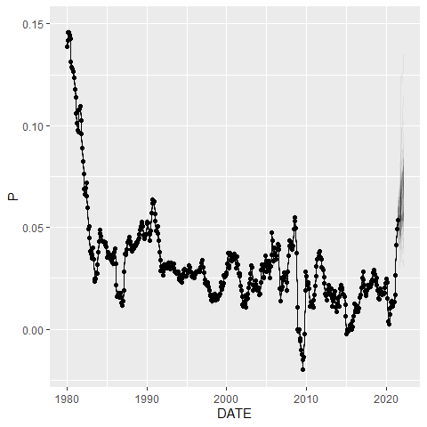<!-- -->

# Model Diagnostics

Unfortunately, the bsts package is relatively small and doesn’t have
very many diagnostics functions like traceplots and number of effective
sample size. However, we are able to judge convergence of the model by
estimating the one step ahead prediction error variance by squaring the
error provided my the bsts model and plotting. Additionally, we see that
we have fairly independent chains seen through the autocorrelation plot.

``` r
par(mfrow=c(2,1))
a <- rowMeans(model$one.step.prediction.errors ^ 2)
plot(a, type = 'l')
r <- residuals(model)
AcfDist(r)
```

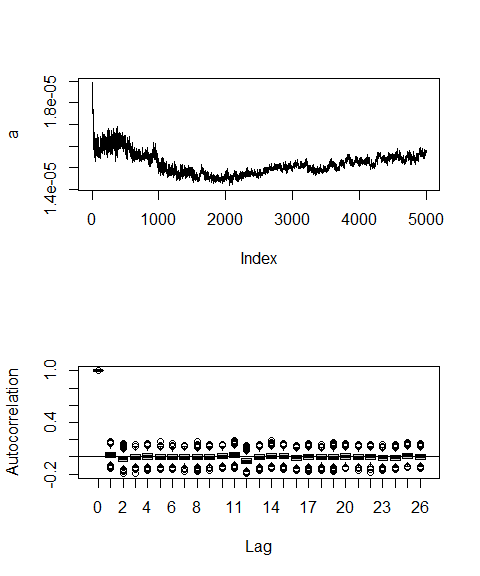<!-- -->

# Posterior Sampling and Updated Priors

Moving on, the plot below is the fit and forecast starting from 2014.
The points are the actual values from the training set, while the blue
line is the posterior predictives of the data, having been trained on
it. The more interesting portion is the scattering red lines, which are
updated prior predictives based on the model fit thus far.
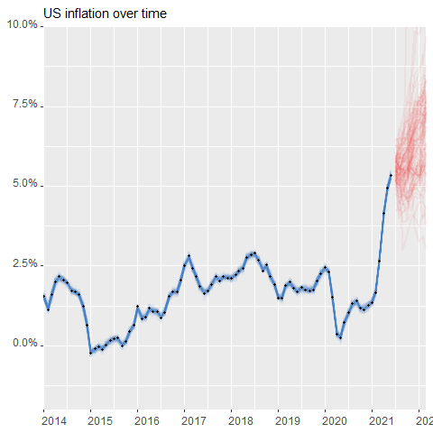<!-- -->

This plot was created for a clearer image, as well as a comparison to
actual inflation figures during the same period, roughly from July 2021
to February 2022. Due to the use of the Student T distribution, the
uncertainty *does* cover the trajectory of the observed inflation.
However, it also suspected a somewhat rapid recovery that doesn’t look
very plausible either.

``` r
monthly_train %>%
  filter(year(DATE) >= since_year) %>%
  ggplot(aes(x = DATE, y = P)) +
  stat_lineribbon(aes(y = .value), fill = adjustcolor(fit_color, alpha.f = .25), color = fit_color, .width = .95,
    data = fits %>% filter(year(DATE) >= since_year)) +
  stat_lineribbon(aes(y = .prediction), fill = adjustcolor(prediction_color, alpha.f = .25), color = prediction_color, .width = .95,
    data = predictions) +
  geom_line(aes(y= P), data = monthly_test)+
  geom_point(size = 0.75) +
  y_axis +
  x_axis +
  title
```

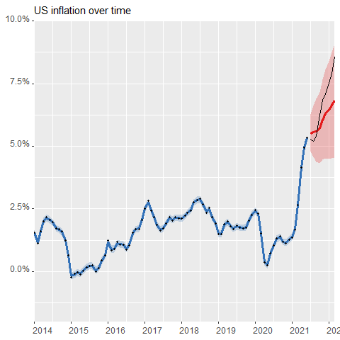<!-- --> The plot
demonstrates the model fit as usual in blue, though in red shows 50
equally likely points at the specified time. Notice how quickly the wide
the dispersion is in the November and February forecasts. Obviously this
is typically a sign of low confidence in future values, though the
February distribution *does* include the actual inflation rate which was
around 0.079.
<!-- -->

# Stratification and Model Comparison

The model we’ve been look at thus far is the total effect of interest
rate on inflation rate. Now we’ll briefly take a look at the direct
effect, which now also stratifies for money velocity, GDP. In addition
to this, we’ll be developing a model using all of the variables, to see
whether this has a positive or negative impact on prediction.

``` r
direct_model = bsts(P~I_m1+V+P_m1+Q, model_components, niter = 5000, data = monthly_train)
allvar_model <- bsts(P~I_m1+V+P_m1+M+Q+I, model_components, niter = 5000, data = monthly_train)
```

``` r
CompareBstsModels(list('Total Effect Model' = model,
                       'Direct Effect Model' = direct_model,
                       'All Var Model' = allvar_model), burn = 200, main = 'Model Prediction Error Comparison')
```

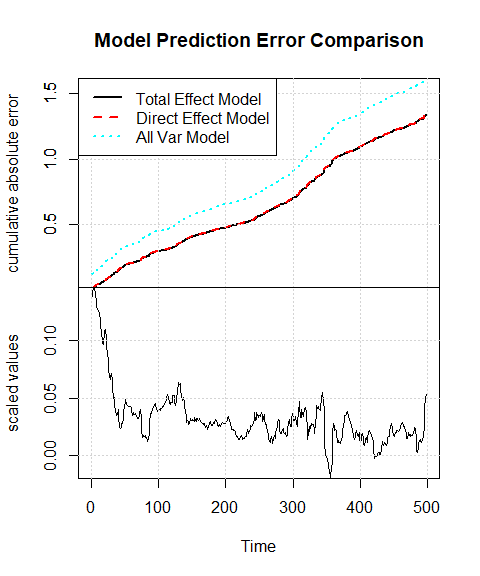<!-- -->

This unexpected increase in error may be due largely to what’s described
in the plots below. You can clearly see that both newer models have a
high inclusion probability for money velocity and likely uses it to
over-explain variation.
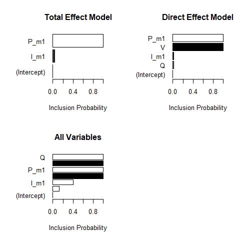<!-- -->

Lastly, point estimates aren’t quite the best use of Bayesian methods,
they’re included here. These values describe:  
The posterior probability that the variable is positive.  
The conditional expectation of the coefficient, given inclusion.  
The conditional standard deviation of the coefficient, given inclusion  
The posterior probability the variable is included.  
You’ll notice that the expected coefficient is positive, which is the
opposite of what’s expected given prior knowledge of macroeconomics. My
best attempt at explaining this would be that the lag used in inflation
is simply too short so the model misinterpreted the relationship.

``` r
summary(model)[6]
```

    ## $coefficients
    ##                      mean          sd     mean.inc     sd.inc   inc.prob
    ## P_m1         0.3138196134 0.058975761  0.313819613 0.05897576 1.00000000
    ## I_m1        -0.0002195938 0.001647937 -0.005828599 0.00629886 0.03767523
    ## (Intercept)  0.0000000000 0.000000000  0.000000000 0.00000000 0.00000000
